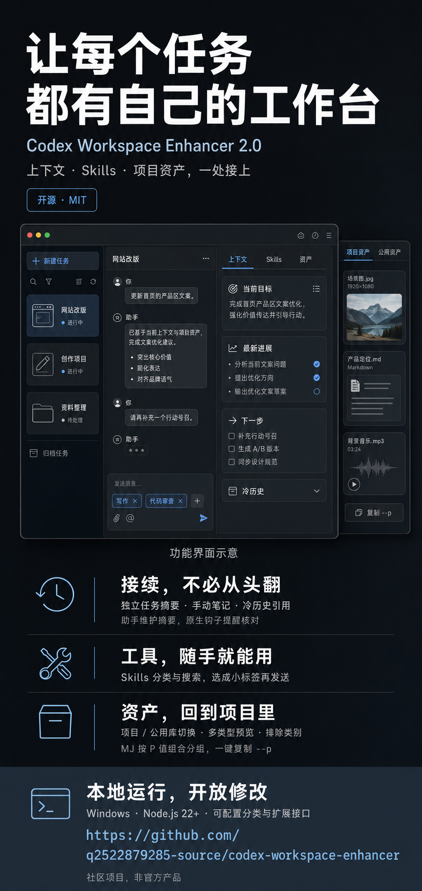

# Codex Workspace Enhancer

[中文](README.md) · [Customization guide](docs/EXTENDING.md)

A local workspace layer for Codex desktop: find tasks, keep concise task context, select Skills, and browse project files without leaving the conversation.



## What it does

- **Find tasks:** card/list views, project filtering, recent activity and message previews.
- **Keep useful context visible:** per-task goals, progress, next steps and agreements, with separate editable notes.
- **Select Skills:** search, favorites and configurable categories; selected Skills become native composer attachments for your next message.
- **Set default Skills (current source):** manage per-task defaults with “添加/删除” (Add/Remove), without permanent delete icons on tags. Once optional summary hooks are enabled and trusted, the next message reminds the assistant to read those Skills. No personal defaults are bundled.
- **Browse project files:** resolve the current task's project or working directory, inspect folders, and preview media, text and supported document contents.
- **Trace relevant outputs:** show explicit history references and recent assets with recorded task provenance.
- **Continue in the conversation:** attach local paths to the composer without automatically sending a message.

The summary is maintained by the assistant, not generated by a separate background model. Optional hooks remind the assistant to read and maintain it. This supports selective context retrieval; it is not automatic perfect memory or a measured token-saving guarantee.

## Install on Windows

Requires Codex desktop and **Node.js 22.13.0 or later**.

Download a package from [Releases](https://github.com/q2522879285-source/codex-workspace-enhancer/releases/latest). **Both ZIP packages include the local asset backend.**

### Skill package

Extract `codex-workspace-enhancer-skill.zip` into `%USERPROFILE%\.codex\skills` (or your custom `CODEX_HOME` Skills directory), then run:

```powershell
powershell -ExecutionPolicy Bypass -File "$env:USERPROFILE\.codex\skills\codex-workspace-enhancer\scripts\install-bundled.ps1"
```

Adjust the command if you use a custom `CODEX_HOME`.

### Windows package

Extract `codex-sidebar-enhancer-windows.zip`, open PowerShell in that folder, and run:

```powershell
powershell -ExecutionPolicy Bypass -File .\install-windows.ps1
```

The default installation directory is `%LOCALAPPDATA%\Programs\Codex Sidebar Enhancer`. Runtime asset configuration and registries live separately in `%LOCALAPPDATA%\CodexSidebarEnhancer\asset-browser`.

The installer does not automatically migrate an older standalone AssetBrowser installation. If port **5177** is already occupied by another service, startup reports the conflict rather than terminating that service. Resolve it deliberately before launching the bundled backend.

## Configure your workspace

- Create `enhancer.config.json` in the installation directory to customize Skill categories and initial favorites.
- Add your own project roots in the asset service's `asset-browser.config.json`. A fresh installation starts with no personal projects and download automation disabled.
- Task summaries normally live at `CODEX_HOME/task-context/<threadId>.json`; `CODEX_HOME` defaults to `~/.codex`.
- Hook setup is optional. Run the installed `scripts/setup-task-context-hooks.mjs` with Node, then review and trust it through Codex's normal `/hooks` interface. Writing a configuration file alone does not prove hooks are active.

See [Customization and extension points](docs/EXTENDING.md) for examples, the summary schema and hook removal.

## Local data and behavior

The asset service listens on `127.0.0.1` and uses a local token. The enhancement does not upload your local task files or media on its own, alter the Codex application package, or rewrite conversation text. Sending a message with an attachment remains a user action handled by Codex.

Generation capture requires explicit configuration and registered generation tickets. Ordinary downloads are not an automatic import source. A file belonging to a project is not assumed to have been produced by its current task.

## Development

```powershell
npm install
npm test
npm run inject
```

The injector expects a local Codex debugging endpoint on port `9231`. Build release packages with:

```powershell
powershell -ExecutionPolicy Bypass -File .\tools\build-release.ps1
```

## Limitations

- Windows is the validated release target. Retained macOS scripts have not been validated on a physical Mac for this release.
- The integration depends on Codex desktop UI structure and internal interfaces; application updates may require adapter changes.
- Office previews extract supported content, not a full Office layout or editor.
- Cold-history references require an existing archive and an appropriate retrieval tool or Skill; linking a path does not create an archive.
- Skill selection and recorded execution agreements do not prove that a Skill has already run.

## License

[MIT](LICENSE)
