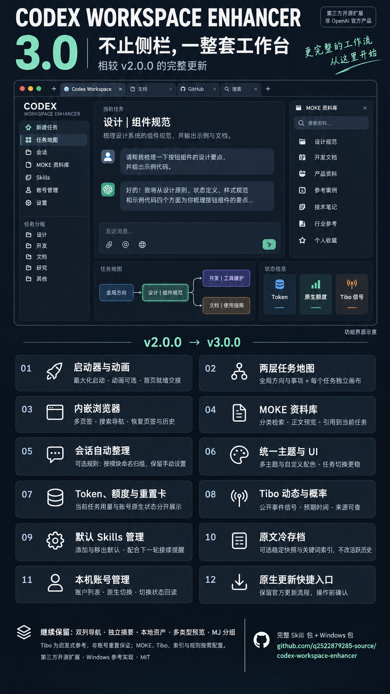

# Codex Workspace Enhancer 3.0

让任务、资料与下一步留在同一个工作台。

把 **任务导航、上下文、工作地图、Skills、浏览器和项目资产** 接进 Codex 桌面应用，保留原生对话与项目结构；本地运行，按需配置。

[下载发布包](https://github.com/q2522879285-source/codex-workspace-enhancer/releases/latest) · [修改与扩展](docs/EXTENDING.md) · [版本区别](CHANGELOG.md) · [English](README.en.md)



## 一套连续的工作台

| 能力 | 工作方式 |
|---|---|
| 启动器与动画 | Windows 启动器、动态调试端口、最大化；可选本地启动视频，随首页就绪释放，保留超时兜底 |
| 全局工作地图 | 方向 → 事项 → 关联会话；地图、列表、关系视图，拖动缩放、状态、下一步、备注、撤销与 JSON 导出 |
| 每任务 Task Map | 一任务一张图，核心计划与手动修改优先；同步有来源的状态，支持编辑、自建节点和展开画布 |
| 内嵌浏览器 | 多页签、地址/搜索、前后导航、刷新；保存页签元数据与导航历史，提供原生会话快速打开与明确提交入口 |
| MOKE 资料库 | 配置并授权自己的 MCP 后，分类检索、分页、正文和 Skill 文件预览、复制与引用到当前输入 |
| 主题与 UI | 多主题、自定义配色与明暗设置，统一地图、资料库、浏览器和任务右栏 |
| 原生额度与账号 | 显示原生额度/重置状态、当前任务 Token 和上下文窗口；本机账号管理与明确切换后回读 |
| Tibo 公开动态 | 可选公共源、事件摘要、来源、预期时间和启发式百分比；与当前账号实际重置分开 |
| 可选原文冷存档 | 稳定后复制任务原文并建立关键词索引，保留活跃历史；自动模式默认关闭 |
| Skills 与接续 | 分类、搜索、收藏、原生输入区标签，以及全局/项目两作用域的默认 Skills 管理 |
| 可选会话整理 | 助手通过原生工具执行「模块名｜持续目标」命名归组并回读，保留手动标题、置顶和项目归属 |
| 原生更新入口 | 确认后调用 Codex 原生检查/更新界面，不另建下载器 |

任务导航、独立摘要/笔记、项目文件预览、来源引用、MJ 分组与复制 `--p` 是保留并继续整合的能力，不是本次首次新增。

## 两张地图，各有用途

**全局工作地图**管理多个方向与事项，并关联原生会话；**每任务 Task Map**保留单个任务的核心计划。两者分开存储，不用会话摘要刷新覆盖手动计划，也不通过编辑节点改写聊天记录。

[每任务 Task Map 使用说明](docs/thread-task-map.md)。可选 CortexDB 只对地图字段和关联会话标题/ID建立单向词法派生索引，不是全部聊天正文搜索或语义记忆。基本地图编辑不依赖 CortexDB。

## 安装

参考平台：**Windows、Node.js >=22.13.0、Codex 桌面应用**。保留的 macOS 脚本没有本版真机验证。

### Windows 安装包

下载 `codex-sidebar-enhancer-windows.zip`，解压后运行：

```powershell
powershell -NoProfile -ExecutionPolicy Bypass -File .\install-windows.ps1
```

### 完整 Skill 包

下载 `codex-workspace-enhancer-skill.zip`，解压到自己的 Codex Skills 目录，通常为 `%USERPROFILE%\.codex\skills`。从解压后的 Skill 目录运行：

```powershell
powershell -NoProfile -ExecutionPolicy Bypass -File .\scripts\inspect.ps1
powershell -NoProfile -ExecutionPolicy Bypass -File .\scripts\install-bundled.ps1 -WhatIf
powershell -NoProfile -ExecutionPolicy Bypass -File .\scripts\install-bundled.ps1
powershell -NoProfile -ExecutionPolicy Bypass -File .\scripts\verify.ps1
```

两个包都包含本地资产后端，安装同一运行核心；Skill 包附带自包含的操作与验收引用，不依赖作者私有 Skill。源码中的 `skill-template/` 需要构建发布包后才能使用 bundle 安装。

安装不强制退出正在运行的 Codex。需要启用调试入口时，正常退出后使用增强器快捷方式。包内附带启动演示视频，也可选择自己的本地视频；播放需要 `ffplay.exe`，缺播放器不阻塞 Codex。

## 配置与可选功能

- **项目目录**：修改本机 `asset-browser.config.json`；新安装不带个人项目，下载捕获/路由默认关闭。
- **Skill 分类与收藏**：在安装目录创建 `enhancer.config.json`，不覆盖用户已有收藏；默认执行项初始为空，提供全局与项目两种作用域；全局影响全部会话，项目只影响该项目，统一保存到 `$CODEX_HOME/skill-defaults.json`，不写入任务摘要或笔记。移除默认不卸载 Skill。
- **摘要提醒**：运行已安装的 `scripts/setup-task-context-hooks.mjs`，再通过 Codex `/hooks` 审阅信任。脚本只合并自己的条目，安装不改全局规则或信任；移除使用 `--remove`。
- **会话命名归组**：按需采用 [task-organization-rules.md](templates/task-organization-rules.md)。主助手在当前任务首次实质结果后执行一次，原生工具写入并回读；不是 watcher 后台改数据库。
- **MOKE**：用户自行配置原生 MCP server `moke` 并授权。预览 Skill 文件不等于安装，也不自动安装。
- **CortexDB**：设置 `CODEX_CORTEXDB_EXECUTABLE` 指向自己安装的兼容程序；可执行文件不随包提供。
- **Tibo 公共源**：设置 `CODEX_TIBO_FEED_URL` 才启用请求。百分比是公开信号的启发式指标，不是校准统计概率、官方承诺或当前账号已重置证据。
- **原文冷存档**：在任务冷历史控件中手动保存或明确启用自动模式；索引需要 Python。存档只复制，不删除或改写活跃历史。

摘要仍由当前助手维护，不另外调用后台总结模型。选择 Skill、写默认约定、收到提醒都不证明已执行；接续机制不承诺无限记忆或固定额度节省比例。

[配置 schema、路径与扩展入口](docs/EXTENDING.md)。

## 本地数据与恢复

| 内容 | Windows 默认位置 |
|---|---|
| 程序 | `%LOCALAPPDATA%\Programs\Codex Sidebar Enhancer` |
| UI 配置 | 安装目录的 `enhancer.config.json` |
| 资产配置、令牌、台账 | `%LOCALAPPDATA%\CodexSidebarEnhancer\asset-browser` |
| 本机账号 profiles | `%LOCALAPPDATA%\CodexSidebarEnhancer\account-profiles.json` |
| 任务摘要 | `$CODEX_HOME/task-context/<threadId>.json`，默认 `~/.codex` |
| 可选原文冷档 | `$CODEX_HOME/cold-history` |
| 地图、页签、笔记 | Codex 本机存储 |
| 原始资产 | 用户自己配置的项目目录 |

已有 `work/task-context.json` 仅在任务 ID 匹配时复用。账号 profiles 含本机认证数据，冷档包含完整原文；它们不进入公开包。

安装保留配置、台账和资产，失败时恢复本次 owned runtime 改动；主动降级使用选定旧版安装器并沿用相同路径，先保留当前状态。运行时回滚不是项目内容或云账号恢复。旧独立 AssetBrowser 不会自动迁移；默认资产端口 5177 冲突时报告问题，不接管或终止其他服务。

公开包不含作者项目、会话、账号、素材、票据和私有 Skill。资产服务在本机使用独立令牌；选择素材只把绝对路径放进输入框，不自动发送。浏览器快速对话只有用户明确提交时才发送到选定原生任务。云资料读取或用户提交的消息遵循对应服务的正常网络行为。

## 开发与验证

```powershell
git clone https://github.com/q2522879285-source/codex-workspace-enhancer.git
cd codex-workspace-enhancer
npm ci
npm test
powershell -NoProfile -ExecutionPolicy Bypass -File .\tools\build-release.ps1
```

[本版可复现验证命令](VERIFICATION.txt)。源测试、包完整性、已安装文件一致性、服务健康、实际桌面交互是不同检查；包校验不证明云登录、网站兼容或账号切换。

## 已知边界

- 社区增强项目，非 OpenAI 官方产品；依赖桌面内部界面与桥接，应用更新可能需要适配。
- 内嵌浏览器受站点与宿主策略限制，保存页签元数据不等于保存网页进程、完整 DOM 或任意登录 profile。
- Office 预览以支持内容提取为主，不是完整排版编辑器。
- MOKE、CortexDB、Python 索引和视频播放器需要用户配置对应服务/依赖；空白安装不附带账号、资料集合或第三方工具。
- Tibo 第三方动态与真实账号额度分开；过期/缺失公开信号不能当作新重置事件。
- 功能示意图不等于实际个人任务截图。

## License

[MIT](LICENSE)
